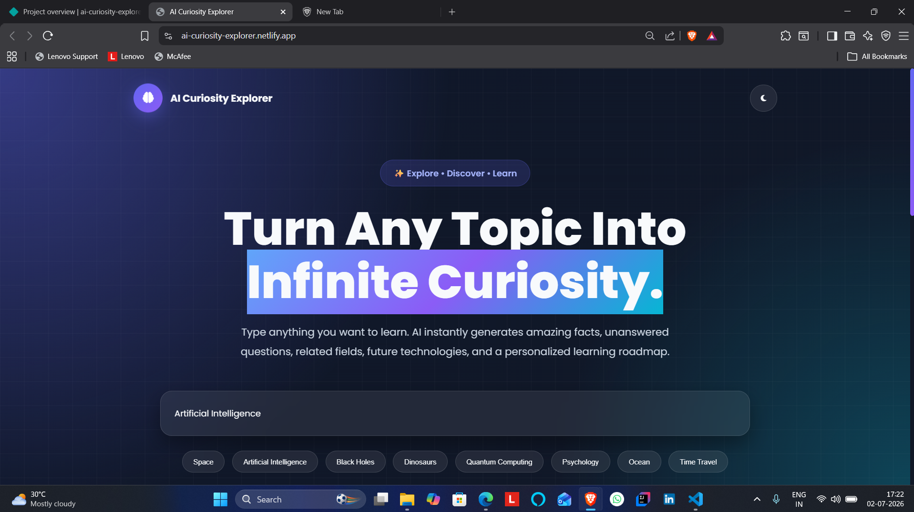
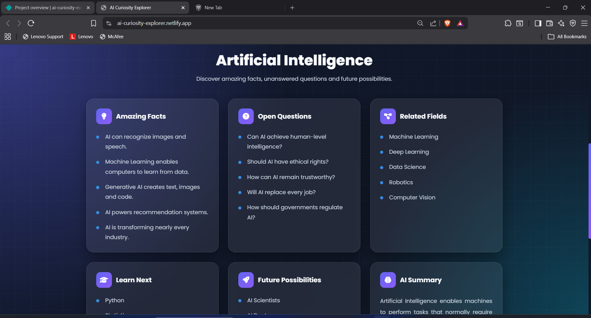

# AI Curiosity Explorer

## 🚀 Day 24 of my 30 Days 30 AI Websites Challenge

AI Curiosity Explorer is an AI-inspired web application that helps users transform any topic into an interactive knowledge exploration experience.

Instead of simply searching for information, users enter any topic and instantly receive a structured curiosity map containing amazing facts, open questions, related fields, recommended learning paths, future possibilities, and an AI-generated summary.

The application demonstrates how AI-powered educational assistants can encourage curiosity-driven learning by organizing information into multiple perspectives rather than presenting plain search results.

Although built using HTML, CSS, and JavaScript, the project simulates the workflow of modern AI knowledge assistants by automatically generating structured learning insights for virtually any subject.

---

## 🌐 Live Demo

https://ai-curiosity-explorer.netlify.app/

---

## 📸 Screenshots

---

## ✨ Features

* AI Curiosity Explorer
* Topic-Based Knowledge Discovery
* Amazing Facts Generator
* Open Questions Discovery
* Related Fields Explorer
* Personalized Learning Suggestions
* Future Possibilities Generator
* AI Topic Summary
* Quick Topic Suggestions
* Interactive Knowledge Cards
* Copy Results
* Download Results
* Share Results
* Dark / Light Mode
* Fully Responsive Design

---

## 📋 How It Works

1. Enter any topic you want to explore.
2. Click **Explore**.
3. AI organizes the topic into multiple knowledge sections.
4. Discover amazing facts and unanswered questions.
5. Explore related fields and recommended learning paths.
6. View future possibilities and the AI-generated summary.
7. Copy, download, or share the generated exploration.

---

## 🛠 Technologies Used

* HTML
* CSS
* JavaScript
* Built with the help of AI-assisted development tools

---

## 🎯 Challenge Progress

✅ Day 24 Completed — AI Curiosity Explorer

Part of my **30 Days 30 AI Websites Challenge**, where I build and publish one AI-inspired web application every day to improve my frontend development, product-building, UI/UX design, and problem-solving skills.

---

## 👨‍💻 Author

**Bettam Anand**

B.Tech CSE (Data Science)

JNTUH University College of Engineering Palair
